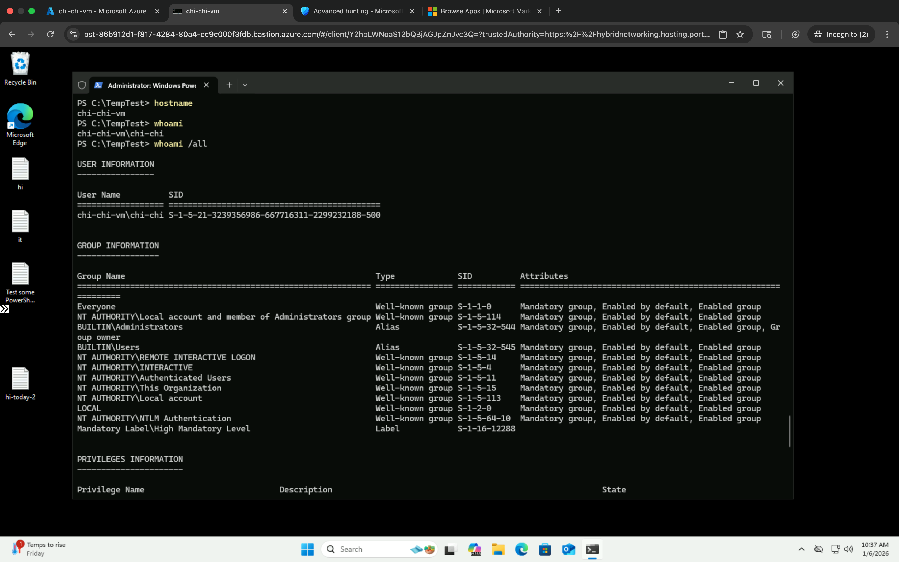
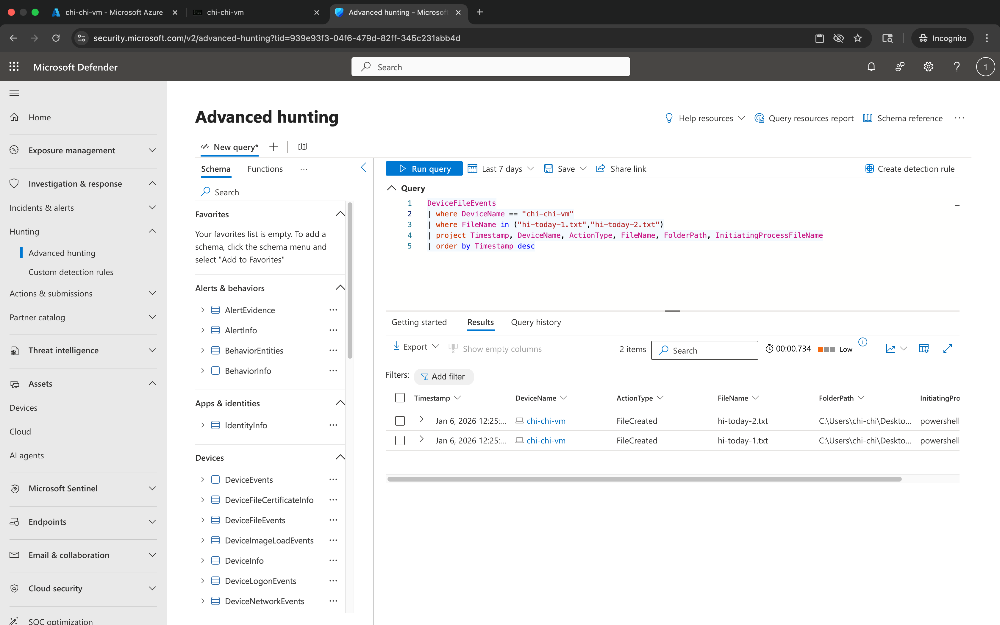
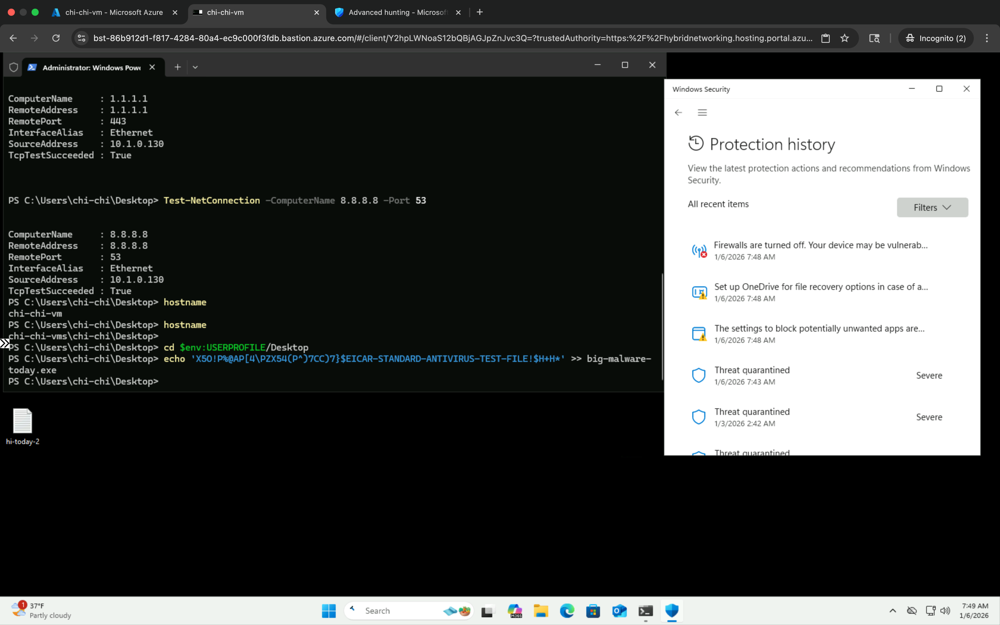
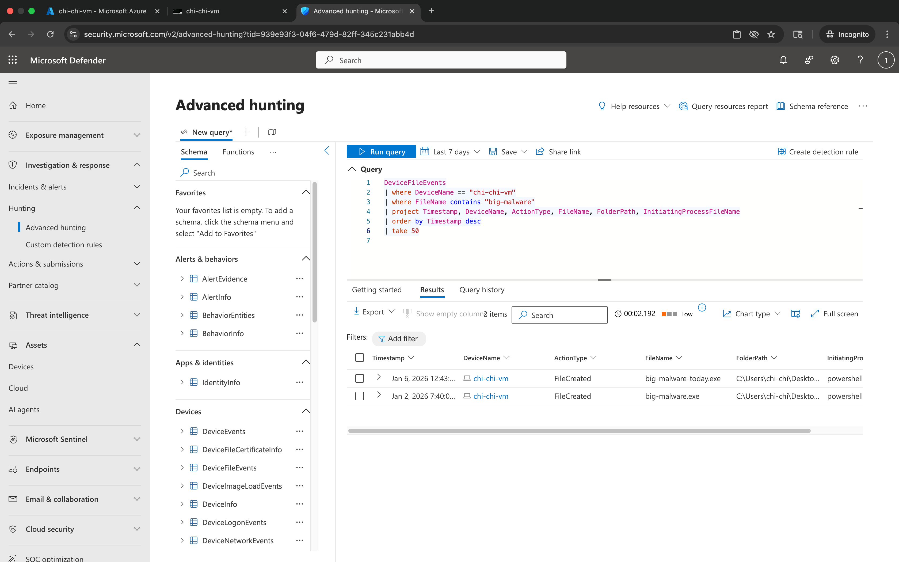

# 🛡️ Microsoft Defender Advanced Hunting & PowerShell Telemetry Lab


## 🔹 Step 1 — Environment & Host Validation

Validated the lab environment by confirming the device name and user context.

**PowerShell Commands**
```powershell
hostname
whoami
```
---

**Screenshot — Environment Validation**



## 🔹 Step 2 — File Creation, Modification & Deletion Telemetry

Simulated normal and suspicious file activity to generate Microsoft Defender telemetry.

**PowerShell Commands**
```powershell
New-Item hi-today-1.txt
New-Item hi-today-2.txt
Remove-Item hi-today-1.txt
```


Screenshot — File Activity Executed in PowerShell  


### Advanced Hunting Query — File Events

```kusto
DeviceFileEvents
| where DeviceName == "chi-chi-vm"
| where FileName startswith "hi-today"
| order by Timestamp desc
| take 50
```

Screenshot — File Events in Microsoft Defender (Advanced Hunting)  


## 🔹 Step 3 — Suspicious Process Execution Telemetry

Generated endpoint telemetry by simulating suspicious command activity in PowerShell.

**PowerShell Command**
```powershell
cd $env:USERPROFILE/Desktop
echo 'X5O!P%@AP[4\PZX54(P^)7CC)7}$EICAR-STANDARD-ANTIVIRUS-TEST-FILE!$H+H*' >> big-malware-today.exe
```

Screenshot — Process Execution in PowerShell  



### Advanced Hunting Query — Process Events

```kusto
DeviceFileEvents
| where DeviceName == "chi-chi-vm"
| where FileName contains "big-malware"
| project Timestamp, DeviceName, ActionType, FileName, FolderPath, InitiatingProcessFileName
| order by Timestamp desc
| take 50
```

Screenshot — Process Events in Microsoft Defender (Advanced Hunting)  


## 🔹 Step 4 — Network Connection Telemetry

Simulated outbound network connections to generate Microsoft Defender telemetry for host-level network activity.

**PowerShell Commands**
```powershell
Test-NetConnection -ComputerName 8.8.8.8 -Port 443
Test-NetConnection -ComputerName 1.1.1.1 -Port 443
Test-NetConnection -ComputerName 8.8.8.8 -Port 53
hostname
```


