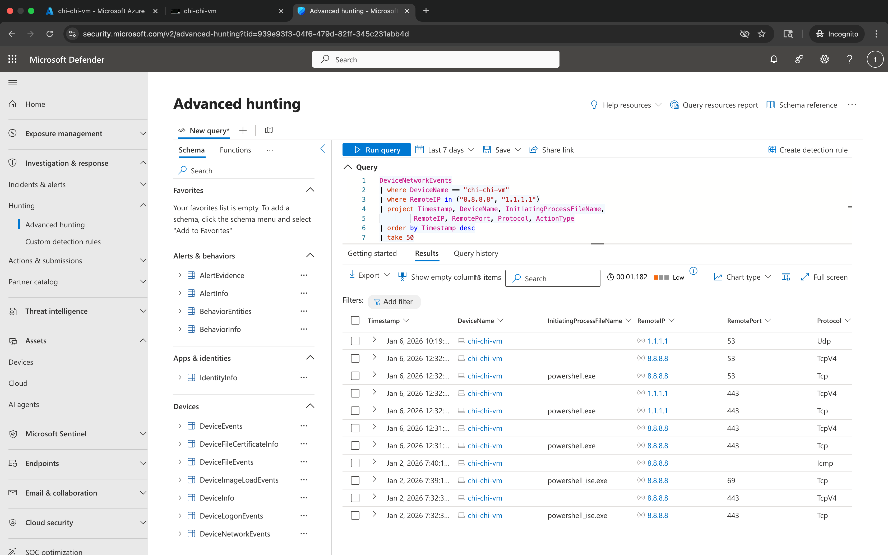

# 🛡️ Microsoft Defender Advanced Hunting & PowerShell Telemetry Lab


## 🔹 Step 1 — Environment & Host Validation

Validated the lab environment by confirming the device name and user context.

**PowerShell Commands**
```powershell
hostname
whoami
```
---

**Screenshot — Environment Validation**


## 🔹 Step 2 — File Creation, Modification & Deletion Telemetry

Simulated normal and suspicious file activity to generate Microsoft Defender telemetry.

**PowerShell Commands**
```powershell
New-Item hi-today-1.txt
New-Item hi-today-2.txt
Remove-Item hi-today-1.txt
```
---

Screenshot — File Activity Executed in PowerShell  


### Advanced Hunting Query — File Events

```kusto
DeviceFileEvents
| where DeviceName == "chi-chi-vm"
| where FileName startswith "hi-today"
| order by Timestamp desc
| take 50
```
---

Screenshot — File Events in Microsoft Defender (Advanced Hunting)  


## 🔹 Step 3 — Suspicious Process Execution Telemetry

Generated endpoint telemetry by simulating suspicious command activity in PowerShell.

**PowerShell Command**
```powershell
cd $env:USERPROFILE/Desktop
echo 'X5O!P%@AP[4\PZX54(P^)7CC)7}$EICAR-STANDARD-ANTIVIRUS-TEST-FILE!$H+H*' >> big-malware-today.exe
```
---

Screenshot — Process Execution in PowerShell  


### Advanced Hunting Query — Process Events

```kusto
DeviceFileEvents
| where DeviceName == "chi-chi-vm"
| where FileName contains "big-malware"
| project Timestamp, DeviceName, ActionType, FileName, FolderPath, InitiatingProcessFileName
| order by Timestamp desc
| take 50
```
---

Screenshot — Process Events in Microsoft Defender (Advanced Hunting)  


## 🔹 Step 4 — Network Connection Telemetry

Simulated outbound network connections to generate Microsoft Defender telemetry for host-level network activity.

**PowerShell Commands**
```powershell
Test-NetConnection -ComputerName 8.8.8.8 -Port 443
Test-NetConnection -ComputerName 1.1.1.1 -Port 443
Test-NetConnection -ComputerName 8.8.8.8 -Port 53
hostname
```
---

### Advanced Hunting Query — Network Events

```kusto
DeviceNetworkEvents
| where DeviceName == "chi-chi-vm"
| where RemoteIP in ("8.8.8.8", "1.1.1.1")
| project Timestamp, DeviceName, InitiatingProcessFileName,
         RemoteIP, RemotePort, Protocol, ActionType
| order by Timestamp desc
| take 50
```
---
Screenshot — Network Events in Microsoft Defender (Advanced Hunting)  


---

## 📂 Repository Structure

- `README.md` — Step-by-step lab guide with PowerShell commands and KQL queries.
- `images/` — Screenshots referenced in the lab:
  - `step1-environment-validation.png`
  - `step2-file-activity-powershell.png`
  - `step2-file-events-advanced-hunting.png`
  - `step3-process-execution-powershell.png`
  - `step3-process-events-advanced-hunting.png`
  - `step4-network-connection-powershell.png`
  - `step4-network-events-advanced-hunting.png`

## 🚀 How to Re-Run This Lab

1. Onboard a Windows endpoint to **Microsoft Defender for Endpoint**.
2. Open an **elevated PowerShell** session on the device.
3. Follow each step in this README:
   - Step 1 — Validate environment (`hostname`, `whoami`)
   - Step 2 — Generate file telemetry with `New-Item` / `Remove-Item`
   - Step 3 — Simulate suspicious behavior using the EICAR test string
   - Step 4 — Generate network telemetry with `Test-NetConnection`
4. In **Microsoft 365 Defender ➜ Advanced hunting**, run the KQL queries in
   Steps 2–4 and confirm events are returned.
5. Compare the screenshots in `images/` with your own results.

## 🧠 Skills Demonstrated

- PowerShell scripting to simulate **file, process, and network** activity
- Writing **Kusto Query Language (KQL)** against:
  - `DeviceFileEvents`
  - `DeviceProcessEvents` (conceptually)
  - `DeviceNetworkEvents`
- Tracing how attacker-like activity appears in Defender telemetry
- Validating **endpoint visibility** across host, file, process, and network layers
- Documenting a security lab with clear steps, queries, and evidence for portfolio use

---

## 📌 Findings Summary

This lab validated that Microsoft Defender for Endpoint successfully captured:

- File creation, modification, and deletion activity (`DeviceFileEvents`)
- Suspicious or high-risk process execution activity (`DeviceProcessEvents`)
- Outbound network connections and protocol telemetry (`DeviceNetworkEvents`)

KQL queries were used to confirm visibility and correlate activity across
file, process, and network layers — reflecting realistic Tier-1 / Tier-2
SOC investigation workflows.

---

## 🛠️ Tools & Technologies

- Microsoft Defender for Endpoint — Advanced Hunting
- PowerShell — activity generation & host interaction
- Kusto Query Language (KQL)
- Windows 11 Virtual Machine (Azure environment)

---

## 🔎 Detection & SOC Relevance

This lab demonstrates practical analyst capabilities:

- Validating endpoint telemetry coverage
- Performing guided threat-hunting using KQL
- Correlating host, file, process, and network behavior
- Translating raw events into investigation context and findings
- Documenting repeatable security validation steps

---

## 🚀 Next Steps (Planned Enhancements)

- Add alert-triage workflow using the Microsoft Defender Incidents queue
- Convert hunting queries into reusable detection rules
- Map activity to MITRE ATT&CK techniques
- Export results and publish a mini investigation report

---


